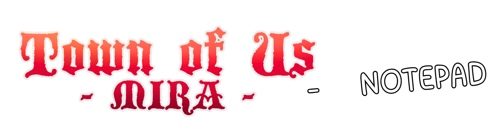

# TOU Notepad Mod

This mod adds an in-game Notepad Minigame to Among Us, integrated with Town of Us Mira (and other MiraAPI mods).

## Features

- **In-Game Notepad**: Full-screen UI to take notes without leaving the game.
- **Roles Tab**: View all active roles, filter by name, and add notes to specific roles.
- **Players Tab**: Track player status (Alive/Dead) and add notes to specific players.
- **General Notes**: A freeform scratchpad for general information.
- **Meeting Timer**: A draggable timer overlay appears during meetings.
- **Clipboard Export**: Export all your notes to the clipboard at the end of the game.
- **Local Storage**: Notes are stored in RAM and wiped after each game. They are never sent to other players.

## Installation

1. Install [Town of Us Mira](https://github.com/eDonnes124/TownOfUs-Mira).
2. Place the `TOU-Notepad.dll` into your `Among Us/BepInEx/plugins/` folder.

## Usage

- **Open/Close**: Press `N` (default) or click the Notepad button on the HUD (cyan tinted map icon).
- **Navigation**: Use the tabs at the top to switch between Roles, Players, and General notes.
- **Editing**: Click on a Role or Player card to open the detail view and edit the note.
- **Export**: Click the "Copy" button in the General tab (or Detail view) to copy all notes to your clipboard.

## For Modders

The mod uses `MiraAPI` to fetch roles. If you are creating a custom role mod using MiraAPI, your roles will automatically appear in the Notepad.

### Hooking into the Notepad

The `NotepadDataManager` class holds all the data.
```csharp
TownOfUs.Modules.Notepad.NotepadDataManager.Instance.GeneralNotes = "New Note";
```

## Credits

- Based on the Town of Us Mira Wiki UI.
- Developed by [Your Name/Handle].
