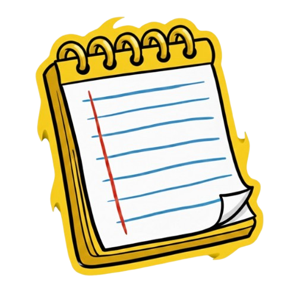

   

  

 
  This mod adds an in-game Notepad to Among Us, integrated with specifically Town of Us Mira.
  This repo also contains a website version of this mod for players who want it

## Features

- **In-Game Notepad**: UI to take notes without leaving the game.
- **Players Tab**: Track player status (Alive/Dead) and jot notes/possible roles to specific players .
- **General Notes**: A freeform scratchpad for general information.
- **Meeting Timer**: A draggable timer overlay appears during meetings.
- **Clipboard Export**: Export all your notes to the clipboard at the end of the game.
- **Local Storage**: Notes are stored in RAM and wiped after each game. They are never sent to other players.

## Installation

1. Install [Town of Us Mira](https://github.com/auavengers/TownOfUs-Mira).
2. Place the `TOU-Notepad.dll` into your `Among Us/BepInEx/plugins/` folder.

## Usage

- **Open/Close**: Press `N` (default) or click the Notepad button on the HUD (cyan tinted map icon).
- **Navigation**: Use the tabs at the top to switch between Players and General notes.
- **Editing**: Click on a Role or Player card to open the detail view and edit the note.

## Credits

- Based on the Detective notes UI.
- Thanks to LaunchpadReloaded for how to get functioning NotepadUI
- Developed by IdkImNeil.
